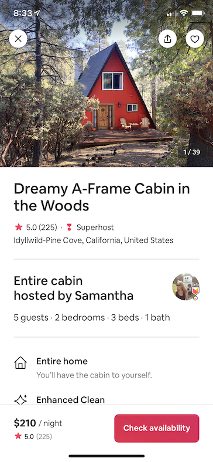
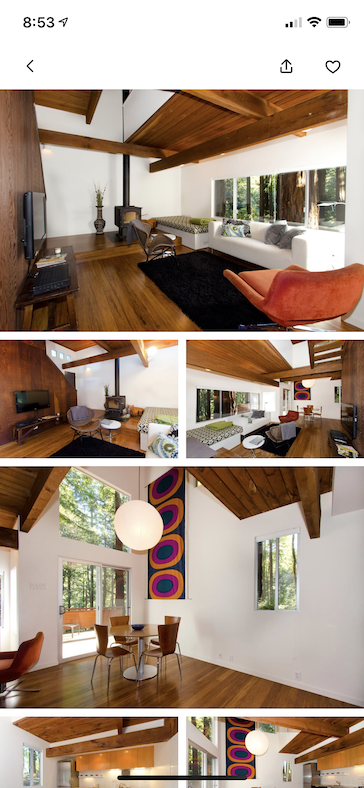
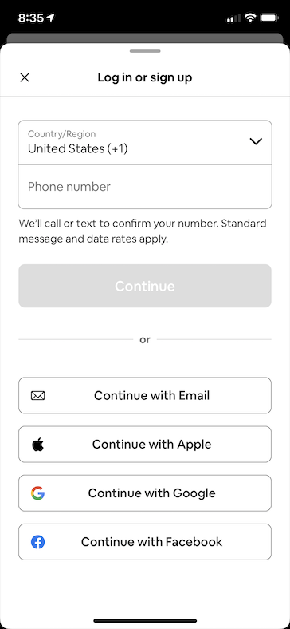
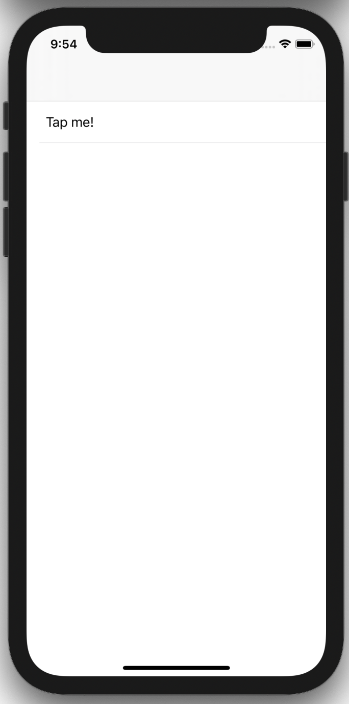
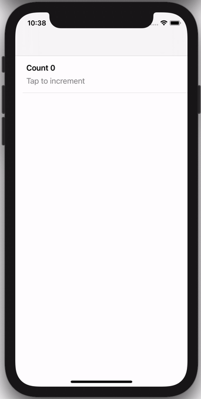
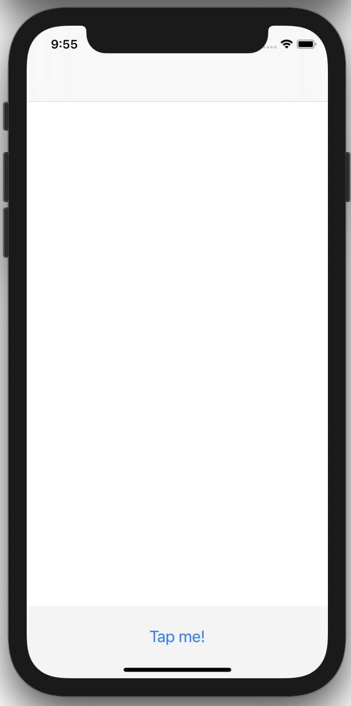
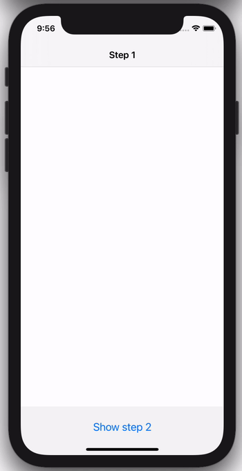
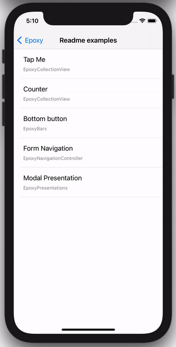

[](https://github.com/airbnb/epoxy-ios/actions?query=branch%3Amaster+workflow%3ACI)
[](https://github.com/apple/swift-package-manager)
[](https://cocoapods.org/pods/Epoxy)
[](https://cocoapods.org/pods/Epoxy)

Epoxy is a suite of declarative UI APIs for building [UIKit](https://developer.apple.com/documentation/uikit) applications in Swift. Epoxy is inspired and influenced by the wonderful [Epoxy framework on Android](https://github.com/airbnb/epoxy), as well as other declarative UI frameworks in Swift such as [SwiftUI](https://developer.apple.com/documentation/swiftui).

Epoxy was developed at [Airbnb](https://www.airbnb.com/) and powers thousands of screens in apps that are shipped to millions of users. It has been developed and refined for years by [dozens of contributors](https://github.com/airbnb/epoxy-ios/graphs/contributors).

Below are a few sample screens from the Airbnb app that we've built using Epoxy. Our usages of Epoxy span from our simplest forms and static screens to our most advanced and dynamic features.
| Home Details | Home Photos | Messaging | Registration |
| --- | --- | --- | --- |
|  |   |  |  |

## Table of contents

* [Installation](#installation)
    * [CocoaPods](#cocoapods)
    * [Swift Package Manager (SPM)](#swift-package-manager-spm)
* [Modules](#modules)
* [Getting Started](#getting-started)
    * [EpoxyCollectionView](#epoxycollectionview)
    * [EpoxyBars](#epoxybars)
    * [EpoxyNavigationController](#epoxynavigationcontroller)
    * [EpoxyPresentations](#epoxypresentations)
* [Documentation and Tutorials](#documentation-and-tutorials)
* [FAQ](#faq)
* [Contributing](#contributing)
* [License](#license)
* [Credits](#credits)

## Installation

Epoxy can be installed using [CocoaPods](#CocoaPods) or [Swift Package Manager](#Swift-Package-Manager-(SPM)).

### CocoaPods

To get started with Epoxy using [Cocoapods](https://cocoapods.org) add the following to your `Podfile` and then follow the [integration instructions](https://guides.cocoapods.org/using/using-cocoapods.html).

```ruby
pod 'Epoxy'
```

Epoxy is separated into [podspecs](https://guides.cocoapods.org/syntax/podspec.html) for each [module](#modules) so you only have to include what you need.

### Swift Package Manager (SPM)

To install Epoxy using [Swift Package Manager](https://github.com/apple/swift-package-manager)  you can follow the [tutorial published by Apple](https://developer.apple.com/documentation/xcode/adding_package_dependencies_to_your_app) using the URL for the Epoxy repo with the current version:

1. In Xcode, select “File” → “Swift Packages” → “Add Package Dependency”
1. Enter https://github.com/airbnb/epoxy-ios.git

Epoxy is separated [library products](https://swift.org/package-manager/#products) for each [module](#modules) so you only have to include what you need.

## Modules

Epoxy has a modular architecture so you only have to include what you need for your use case:

| Module | Description |
| ------ | ----------- |
| [`Epoxy`](https://github.com/airbnb/epoxy-ios/blob/master/Sources/Epoxy/Exports.swift) | Includes all of the below modules in a single import statement |
| [`EpoxyCollectionView`](#EpoxyCollectionView) | Declarative API for driving the content of a [`UICollectionView`](https://developer.apple.com/documentation/uikit/uicollectionview) |
| [`EpoxyNavigationController`](#EpoxyNavigationController) | Declarative API for driving the navigation stack of a [`UINavigationController`](https://developer.apple.com/documentation/uikit/uinavigationcontroller) |
| [`EpoxyPresentations`](#EpoxyPresentations) | Declarative API for driving the modal presentations of a [`UIViewController`](https://developer.apple.com/documentation/uikit/uiviewcontroller) |
| [`EpoxyBars`](#EpoxyBars) | Declarative API for adding fixed top/bottom bar stacks to a [`UIViewController`](https://developer.apple.com/documentation/uikit/uiviewcontroller) |
| [`EpoxyCore`](https://github.com/airbnb/epoxy-ios/wiki/EpoxyCore) | Foundational APIs that are used to build all Epoxy declarative UI APIs |

## Getting Started

### EpoxyCollectionView

`EpoxyCollectionView` provides a declarative API for driving the content of a `UICollectionView`. `CollectionViewController` is a subclassable `UIViewController` that lets you easily spin up a `UICollectionView`-backed view controller with a declarative API.

The following code samples will render a single cell in a `UICollectionView` with a `TextRow` component rendered in that cell. `TextRow` is a simple `UIView` containing two labels that conforms to the [`EpoxyableView`](https://github.com/airbnb/epoxy-ios/wiki/EpoxyCore#views) protocol.

You can either instantiate a `CollectionViewController` instance directly with sections, e.g. this view controller with a selectable row:

<table>
<tr><td> Source </td> <td> Result </td></tr>
<tr>
<td>

```swift
enum DataID {
  case row
}

let viewController = CollectionViewController(
  layout: UICollectionViewCompositionalLayout
    .list(using: .init(appearance: .plain)),
  items: {
    TextRow.itemModel(
      dataID: DataID.row,
      content: .init(title: "Tap me!"),
      style: .small)
      .didSelect { _ in
        // Handle selection
      }
  })
```

</td>
<td>



</td>
</tr>
</table>

Or you can subclass `CollectionViewController` for more advanced scenarios, e.g. this view controller that keeps track of a running count:

<table>
<tr><td> Source </td> <td> Result </td></tr>
<tr>
<td>

```swift
class CounterViewController: CollectionViewController {
  init() {
    let layout = UICollectionViewCompositionalLayout
      .list(using: .init(appearance: .plain))
    super.init(layout: layout)
    setSections(sections, animated: false)
  }

  private enum DataID {
    case row
  }

  private var count = 0 {
    didSet { setSections(sections, animated: true) }
  }

  @SectionModelBuilder private var sections: [SectionModel] {
    SectionModel {
      TextRow.itemModel(
        dataID: DataID.row,
        content: .init(
          title: "Count \(count)",
          body: "Tap to increment"),
        style: .large)
        .didSelect { [weak self] _ in
          self?.count += 1
        }
    }
  }
}
```
</td>
<td>



</td>
</tr>
</table>

You can learn more about `EpoxyCollectionView` in its [wiki entry](https://github.com/airbnb/epoxy-ios/wiki/EpoxyCollectionView).

### EpoxyBars

`EpoxyBars` provides a declarative API for rendering fixed top, fixed bottom, or [input accessory](https://developer.apple.com/documentation/uikit/uiresponder/1621119-inputaccessoryview) bar stacks in a `UIViewController`.

The following code example will render a `ButtonRow` component fixed to the bottom of the `UIViewController`'s view. `ButtonRow` is a simple `UIView` component that contains a single `UIButton` constrained to the margins of the superview that conforms to the [`EpoxyableView`](https://github.com/airbnb/epoxy-ios/wiki/EpoxyCore#views) protocol:

<table>
<tr><td> Source </td> <td> Result </td></tr>
<tr>
<td>

```swift
class BottomButtonViewController: UIViewController {
  override func viewDidLoad() {
    super.viewDidLoad()
    bottomBarInstaller.install()
  }

  private lazy var bottomBarInstaller = BottomBarInstaller(
    viewController: self,
    bars: bars)

  @BarModelBuilder private var bars: [BarModeling] {
    ButtonRow.barModel(
      content: .init(text: "Click me!"),
      behaviors: .init(didTap: {
        // Handle button selection
      }))
  }
}
```

</td>
<td>



</td>
</tr>
</table>

You can learn more about `EpoxyBars` in its [wiki entry](https://github.com/airbnb/epoxy-ios/wiki/EpoxyBars).

### EpoxyNavigationController

`EpoxyNavigationController` provides a declarative API for driving the navigation stack of a `UINavigationController`.

The following code example shows how you can use this to easily drive a feature that has a flow of multiple view controllers:

<table>
<tr><td> Source </td> <td> Result </td></tr>
<tr>
<td>

```swift
class FormNavigationController: NavigationController {
  init() {
    super.init()
    setStack(stack, animated: false)
  }

  private struct State {
    var showStep2 = false
  }

  private enum DataID {
    case step1, step2
  }

  private var state = State() {
    didSet { setStack(stack, animated: true) }
  }

  @NavigationModelBuilder private var stack: [NavigationModel] {
    NavigationModel.root(dataID: DataID.step1) { [weak self] in
      Step1ViewController(didTapNext: {
        self?.state.showStep2 = true
      })
    }

    if state.showStep2 {
      NavigationModel(
        dataID: DataID.step2,
        makeViewController: {
          Step2ViewController(didTapNext: {
            // Navigate away from this step.
          })
        },
        remove: { [weak self] in
          self?.state.showStep2 = false
        })
    }
  }
}
```

</td>
<td>



</td>
</tr>
</table>

You can learn more about `EpoxyNavigationController` in its [wiki entry](https://github.com/airbnb/epoxy-ios/wiki/EpoxyNavigationController).

### EpoxyPresentations

`EpoxyPresentations` provides a declarative API for driving the modal presentation of a `UIViewController`.

The following code example shows how you can use this to easily drive a feature that shows a modal when it first appears:

<table>
<tr><td> Source </td> <td> Result </td></tr>
<tr>
<td>

```swift
class PresentationViewController: UIViewController {
  override func viewDidAppear(_ animated: Bool) {
    super.viewDidAppear(animated)
    setPresentation(presentation, animated: true)
  }

  private enum DataID {
    case detail
  }

  private var showDetail = true {
    didSet {
      setPresentation(presentation, animated: true)
    }
  }

  private var presentation: PresentationModel? {
    guard showDetail else { return nil }

    return PresentationModel(
      dataID: DataID.detail,
      presentation: .system,
      makeViewController: { [weak self] in
        DetailViewController(didTapDismiss: {
          // Handle tapping the dismiss button:
          self?.showDetail = false
        })
      },
      dismiss: { [weak self] in
        // Or swiping down the sheet:
        self?.showDetail = false
      })
  }
}
```

</td>
<td>



</td>
</tr>
</table>

You can learn more about `EpoxyPresentations` in its [wiki entry](https://github.com/airbnb/epoxy-ios/wiki/EpoxyPresentations).

## Documentation and Tutorials

For full documentation and step-by-step tutorials please check the [wiki](https://github.com/airbnb/epoxy-ios/wiki).

There's also a full sample app with a lot of examples that you can either run via the `EpoxyExample` scheme in `Epoxy.xcworkspace` or browse its [source](https://github.com/airbnb/epoxy-ios/tree/master/Example).

If you still have questions, feel free to create a new [issue](https://github.com/airbnb/epoxy-ios/issues).

## FAQ

- [Why would I use Epoxy and UIKit instead of SwiftUI?](https://github.com/airbnb/epoxy-ios/wiki/FAQ#why-would-i-use-epoxy-and-uikit-instead-of-swiftui)
- [How does Epoxy for iOS differ from Epoxy for Android?](https://github.com/airbnb/epoxy-ios/wiki/FAQ#how-does-epoxy-for-ios-differ-from-epoxy-for-android)

## Contributing

Pull requests are welcome! We'd love help improving this library. Feel free to browse through open [issues](https://github.com/airbnb/epoxy-ios/issues) to look for things that need work. If you have a feature request or bug, please open a new issue so we can track it. Contributors are expected to follow the [Code of Conduct](./CODE_OF_CONDUCT.md).

## License

Epoxy is released under the Apache License 2.0. See `LICENSE` for details.

## Credits
Logo design by [Alana Hanada](https://twitter.com/AlanaHanada) and [Jonard La Rosa](https://twitter.com/NotJoNacho)
